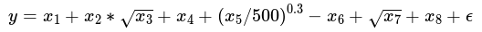

```{r setup, include=FALSE}
knitr::opts_chunk$set(echo = TRUE)
library(reticulate)
library(knitr)
opts_chunk$set('python', engine.path='/usr/bin/python3.4')
knitr::knit_engines$set(python = reticulate::eng_python) 
```

### Introduction

This package provides The python Library for Bagging of Deep Residual Neural Networks (baggingrnet). 
Current version just supports the KERAS package of deep learning and 
will extend to the others in the future. 
The following functionaity is provoded in this package: 
* model
    multBagging: Major class to parallel bagging of autoencoder-based deep residual networks.  You can setup its aruments for optimal effects. See the class and its member functions' help for details.  
    resAutoencoder: Major class of the base model of autoencoder-based deep residual network. See the specifics for its details. 
    ensPrediction: Major class to ensemble predictions and optional evaluation for independent test.  
* util
    pmetrics: main metrics including rsquare and rmse etc.

* data
   data: function to access two sample datas to test and demonstrate parallel training and predictions of multiple models by bagging. 
  simData: function to simulate the dataset for a test. 

### Installation of the package 

 (1) You can directly install this package using the following command for the latest version:
 
          pip install baggingrnet  

 (2) You can also clone the repository and then install:
 
         git clone --recursive https://github.com/lspatial/baggingrnet.git
         pip install ./setup.py install 
         
```{python include=FALSE}
def warn(*args, **kwargs):
    pass
import warnings
warnings.warn = warn
```

```{python echo=FALSE,results='hide', message=F, warning=F}
import pandas as pd 
import numpy as np 
import baggingrnet as bnet
import os
import shutil

def chkpath(tpath):
    if os.path.exists(tpath):
        shutil.rmtree(tpath)
    os.mkdir(tpath)
```
### Modeling Framework  

The modeling is based on bagging of the encoding-decoding antoencoder based deep residual multilayer percepton (MLP). Residual connections were used from the encoding to decoding layers to improve the learning efficiency and use of bagging is to achieve the stable  and improved ensemble predictions, with uncertainty metric (standard deviation). 


The relevant paper will be published and will update here once published. 

### Example 1: Regression of Simulated Data  
The dataset is simulated using the following formula:


each covariate defined as:
$$       x_1 \sim U(1,100), x_2 \sim U(0,100), x_3 \sim U(1,10), x_4 \sim U(1,100),  
       x_5 \sim U(9,100),x_6 \sim U(1,1009),x_7 \sim U(5,300),x_8~U(6 \sim 200) $$
This example is to illustrate how to use bagging class to train a model and compare the results by the models with and without use of residual connections in the models. 
  
###### 1) Load the dataset:   

```{python eval=TRUE}
from baggingrnet.data import data

sim_train=data('sim_train')
sim_train['gindex']=np.array([i for i in range(sim_train.shape[0])])
```
```{r echo=TRUE, message=FALSE, warning=FALSE}
knitr::kable(py$sim_train[c(1:5),], format = "html")
```

###### 2) Set bagging path, list of predictor names, get the bagging class instance and input data:

```{python eval=FALSE}
# Load the major class for parallel bagging training
from baggingrnet.model.bagging import  multBagging  

feasList = ['x'+str(i) for i in range(1,9)] #List of the covariates used in training 
target='y' # Name of the target variable 
bagpath='/tmp/sim_bagging/res' # Path used to 
chkpath(bagpath)
mbag=multBagging(bagpath)
mbag.getInputSample(sim_train, feasList,None,'gindex',target)
```

###### 3) Define the arguments of a model and append it to the list of modeling duties: 

```{python  eval=FALSE}
name = str(0) # model name as unique identifier 
nodes = [32,16,8,4] # List of number of nodes for the encoding and coding layers, adjustable optionally; 
minibatch = 512 # Size for mini batch 
isresidual = True # Whether to use residual connections in the model 
nepoch = 200 #Number of epoches 
sampling_fea = False # Whether to bootstrap the predictors/features 
noutput = 1 # Number of the output node 
islog=False # Whether to make the log transformation 
# The following is to add the model's arguments to the list of duties. 
mbag.addTask(name,noutput,sampling_fea, nepoch, nodes, minibatch, isresidual,islog)
```

###### 4) Initiate the training:

```{python eval=FALSE}
mbag.startMProcess(1)
```

Here, just one core is used for one model. 

###### 5) Prediction using the trained models and optional evaluation of the trained model:

```{python eval=FALSE}
from baggingrnet.model.baggingpre import  ensPrediction
# Load the test dataset 
sim_test=data('sim_test')
sim_test['gindex']=np.array([i for i in range(sim_test.shape[0])]) # Generate the unique id for merging the predicitons of multiple models 
# Setup the path and target variable  
prepath="/tmp/sim_bagging/res_pre"
chkpath(prepath)
#Load the prdiction class
mbagpre=ensPrediction(bagpath,prepath)
#Load the test data 
mbagpre.getInputSample(sim_test, feasList,'gindex')
#Start to make predictions for multiple trained models. 
mbagpre.startMProcess(1)
#Obtain the ensemble predictions from those of multiple models and optional evaluation of the models. 
mbagpre.aggPredict(isval=True,tfld='y')
```

The above five steps illustrate the process of loading data, training, testing, and predicting. To compare with the results of residual models, the following code is to get the results for the non-residual models. 

```{python eval=FALSE, echo=TRUE,message=F, warning=F}
mbag.removeTask(name)
bagpath='/tmp/sim_bagging/nores'
chkpath(bagpath)
mbag_nores=multBagging(bagpath)
mbag_nores.getInputSample(sim_train, feasList,None,'gindex','y')
isresidual = False  # This is to set no use of residual connections in the models. 
mbag_nores.addTask(name,noutput,sampling_fea, nepoch, nodes, minibatch, isresidual,islog)
mbag_nores.startMProcess(1) 
prepath="/tmp/sim_bagging/nores_pre"
chkpath(prepath)
mbagpre=ensPrediction(bagpath,prepath)
mbagpre.getInputSample(sim_test, feasList,'gindex')
mbagpre.startMProcess(1)
mbagpre.aggPredict(isval=True,tfld='y')

```

The comparison of the training/learning curves for residual and non-residual models:  

```{r eval=TRUE, echo=FALSE, fig.width=8, fig.height=3,dpi=100}
nonresHFl="/tmp/sim_bagging/nores/m_0/d_0_trainhist.csv"
resHFl="/tmp/sim_bagging/res/m_0/d_0_trainhist.csv"
histnonres=read.csv(nonresHFl,row.names = NULL)
histnonres$epoch=histnonres$X+1 
histres=read.csv(resHFl,row.names = NULL)
histres$epoch=histres$X+1
par(mfrow=c(1,2),mar=c(4,4,1,1))
plot(histnonres$epoch,histnonres$r2K,xlab="Training epoch",ylim=c(0,1),
       ylab=expression("R"^2),type="l",lty=2,col="blue")
lines(histnonres$epoch,histnonres$val_r2K,col="blue",lty=1) 
lines(histres$epoch,histres$r2K,col="red",lty=2) 
lines(histres$epoch,histres$val_r2K,col="red",lty=1) 
legend(5,0.5,lty=c(2,1,2,1),col=c("red","red","blue","blue"),bty="n",
       legend=c("Training of residual model","Validatiion of residual model",
                "Training of non-residual model","Validatiion of non-residual model"),
       cex=0.9) 

plot(histnonres$epoch,histnonres$mean_squared_error,xlab="Training epoch",ylim=c(0,1),
       ylab="Mean squared error",type="l",lty=2,col="blue")
lines(histnonres$epoch,histnonres$val_mean_squared_error,col="blue",lty=1) 
lines(histres$epoch,histres$mean_squared_error,col="red",lty=2) 
lines(histres$epoch,histres$val_mean_squared_error,col="red",lty=1) 
legend(5,0.9,lty=c(2,1,2,1),col=c("red","red","blue","blue"),bty="n",
       legend=c("Training of residual model","Validatiion of residual model",
                "Training of non-residual model","Validatiion of non-residual model"),
       cex=0.9) 
```

The comparison of the independent test for residual and non-residual models: performance (R2 and RMSE) 

```{r echo=FALSE, fig.width=9, fig.height=3,dpi=100}
library(sptemExp)
tfl="/tmp/sim_bagging/nores_pre/aggpreds_eval.csv"
nonrespreds=read.csv(tfl,row.names = NULL)
tfl="/tmp/sim_bagging/res_pre/aggpreds_eval.csv"
respreds=read.csv(tfl,row.names = NULL)
nonres_r2=rSquared(nonrespreds$y,nonrespreds$y-nonrespreds$mean)
nonres_rmse=rmse(nonrespreds$y,nonrespreds$mean)
res_r2=rSquared(respreds$y,respreds$y-respreds$mean)
res_rmse=rmse(respreds$y,respreds$mean)
print(paste("non residual model   r2: ",round(nonres_r2,2),", rmse: ",round(nonres_rmse,2),sep=""))
print(paste("residual model   r2: ",round(res_r2,2),", rmse: ",round(res_rmse,2),sep=""))
print(paste("Residual model improved R2 by ",round((res_r2 - nonres_r2)*100,2),"%, compared with non-residual model",sep=""))
print(paste("Residual model decreased rmse by ",round(res_rmse - nonres_rmse,2),", compared with non-residual model",sep=""))

```
The scatter comparison of residual vs. non-residual models for the independent test:

```{r echo=FALSE, fig.width=8, fig.height=3,dpi=100}
par(mfrow=c(1,2),mar=c(4,4,1,1)) 
plot(nonrespreds$y,nonrespreds$mean,ylim=c(-1100,500),xlab="Observed value (non-residual model)",ylab="Predicted value")
lines(c(-1000,600),c(-1000,600),col="red")
legend(-300,-600,col=c("black","red"),lty=c(NA,1),pch=c(1,NA),bty="n",
       legend=c("Sample","Reference line"))
plot(respreds$y,respreds$mean,ylim=c(-1100,500),xlab="Observed value  (non-residual model)",ylab="Predicted value")
lines(c(-1000,600),c(-1000,600),col="red")
legend(-300,-600,col=c("black","red"),lty=c(NA,1),pch=c(1,NA),bty="n",
       legend=c("Sample","Reference line"))
```


### Example 2: Spatiotemporal Estimation of PM<sub>2.5</sub>

This dataset is the real dataset of the 2015 PM<sub>2.5</sub> and the relevant covariates for the Beijing-Tianjin-Tangshan area. Due to data security reason, it has been added with small Gaussian noise.  


###### 1) Load input data: 

Here the PM<sub>2.5</sub>  dataset is used to test the proposed methods.  
```{python eval=TRUE, results='hide', message=F, warning=F}
from baggingrnet.data import data
pm25_train=data('pm2.5_train')
pm25_train['gindex']=np.array([i for i in range(pm25_train.shape[0])])
```
```{r eval=TRUE,echo=FALSE, message=FALSE, warning=FALSE}
knitr::kable(py$pm25_train[c(1:5),c(1:12)], format = "html")
```

###### 2) Set bagging path, list of predictor names, get the bagging class instance and input data: 

```{python eval=TRUE}
from baggingrnet.model.bagging import  multBagging
import random as r 
feasList = ['lat', 'lon', 'ele', 'prs', 'tem', 'rhu', 'win', 'pblh_re', 'pre_re', 'o3_re', 'aod', 'merra2_re', 'haod',
         'shaod', 'jd','lat2','lon2','latlon']
target='pm25_avg_log'
bagpath='/tmp/baggingpm25_2/res'
chkpath(bagpath)
mbag=multBagging(bagpath)
mbag.getInputSample(pm25_train, feasList,None,'gindex',target)

```

###### 3) Define the arguments of multiple models (here 100 models) and append them to the list of modeling duties: 

```{python eval=TRUE}
import random as r 
for i in range(1,81):
    name = str(i)
    nodes = [128 + r.randint(-5,5),128+ r.randint(-5,5),96,64,32,12]
    minibatch = 2560+r.randint(-5,5)
    isresidual = False
    nepoch = 120
    sampling_fea = False
    noutput = 1
    islog=True
    mbag.addTask(name,noutput,sampling_fea, nepoch, nodes, minibatch, isresidual,islog)
    
```

###### 4) Initiate the training:
Initiate the parallel programs using 10 cores 

```{python eval=FALSE}

mbag.startMProcess(10)

```

###### 5) Prediction using the trained models and optional evaluation of the trained model:

```{python eval=FALSE}

from baggingrnet.model.baggingpre import  ensPrediction
prepath="/tmp/baggingpm25_2p/res"
chkpath(prepath)
mbagpre=ensPrediction(bagpath,prepath)
mbagpre.getInputSample(pm25_test, feasList,'gindex')
mbagpre.startMProcess(10)
mbagpre.aggPredict(isval=True,tfld='pm25_davg')

```

Finally, the following results were obtaned. 

The results are shown as the following: 

###### 1) Typical learning curves of non-residual vs. residual models are shown as the following: 

```{r eval=TRUE, echo=FALSE, fig.width=8, fig.height=3,dpi=100}
nonresHFl="/testpath/baggingpm25_2/nores/m_65/d_65_trainhist.csv"
resHFl="/testpath/baggingpm25_2/res/m_12/d_12_trainhist.csv"
histnonres=read.csv(nonresHFl,row.names = NULL)
histnonres$epoch=histnonres$X+1 
histres=read.csv(resHFl,row.names = NULL)
histres$epoch=histres$X+1
par(mfrow=c(1,2),mar=c(4,4,1,1))
plot(histnonres$epoch,histnonres$r2K,xlab="Training epoch",ylim=c(0,1),
       ylab=expression("R"^2),type="l",lty=2,col="blue")
lines(histnonres$epoch,histnonres$val_r2K,col="blue",lty=1) 
lines(histres$epoch,histres$r2K,col="red",lty=2) 
lines(histres$epoch,histres$val_r2K,col="red",lty=1) 
legend(5,0.5,lty=c(2,1,2,1),col=c("red","red","blue","blue"),bty="n",
       legend=c("Training of residual model","Validatiion of residual model",
                "Training of non-residual model","Validatiion of non-residual model"),
       cex=0.9) 

plot(histnonres$epoch,histnonres$mean_squared_error,xlab="Training epoch",ylim=c(0,1),
       ylab="Mean squared error",type="l",lty=2,col="blue")
lines(histnonres$epoch,histnonres$val_mean_squared_error,col="blue",lty=1) 
lines(histres$epoch,histres$mean_squared_error,col="red",lty=2) 
lines(histres$epoch,histres$val_mean_squared_error,col="red",lty=1) 
legend(5,0.9,lty=c(2,1,2,1),col=c("red","red","blue","blue"),bty="n",
       legend=c("Training of residual model","Validatiion of residual model",
                "Training of non-residual model","Validatiion of non-residual model"),
       cex=0.9) 
```

###### 2) Mean performance (R2 and RMSE) of the predictions of multiple non-residual vs residual models for the independent dataset : 

```{r eval=TRUE, echo=FALSE, fig.width=8, fig.height=3,dpi=100}
par(mfrow=c(1,2),mar=c(4,4,1,1)) 
tfl="/testpath/baggingpm25_2/nores/allresult.csv"
nonres_m=read.csv(tfl,row.names = NULL)
tfl="/testpath/baggingpm25_2/res/allresult.csv"
res_m=read.csv(tfl,row.names = NULL)
boxplot(nonres_m$testr2,res_m$testr2,names=c("Non-residual Net","Residual Net"),ylab=expression("R"^2))
boxplot(nonres_m$testrmse,res_m$testrmse,names=c("Non-residual Net","Residual Net"),ylab="RMSE")

```

###### 3) Performance (R2 and RMSE) of the ensembled predictions based on multiple models for the independent dataset:  

```{r eval=TRUE, echo=FALSE, fig.width=9, fig.height=3,dpi=100}
library(sptemExp)
tfl="/testpath/baggingpm25_2p/nores/aggpreds_eval.csv"
nonrespreds=read.csv(tfl,row.names = NULL)
tfl="//testpath/baggingpm25_2p/res/aggpreds_eval.csv"
respreds=read.csv(tfl,row.names = NULL)
nonres_r2=rSquared(nonrespreds$pm25_davg,nonrespreds$pm25_davg-nonrespreds$mean)
nonres_rmse=rmse(nonrespreds$pm25_davg,nonrespreds$mean)
res_r2=rSquared(respreds$pm25_davg,respreds$pm25_davg-respreds$mean)
res_rmse=rmse(respreds$pm25_davg,respreds$mean)
print(paste("non residual model   r2: ",round(nonres_r2,2),", rmse: ",round(nonres_rmse,2),sep=""))
print(paste("residual model   r2: ",round(res_r2,2),", rmse: ",round(res_rmse,2),sep=""))
print(paste("Residual model improved R2 by ",round((res_r2 - nonres_r2)*100,2),"%, compared with non-residual model",sep=""))
print(paste("Residual model decreased rmse by ",round(res_rmse - nonres_rmse,2),", compared with non-residual model",sep=""))

```

###### 4) Scatter plots for the ensemble predictions of non-residual vs residual models:  

```{r eval=TRUE, echo=FALSE,fig.width=8, fig.height=3,dpi=100}
par(mfrow=c(1,2),mar=c(4,4.3,1,1)) 
plot(nonrespreds$pm25_davg,nonrespreds$mean,ylim=c(0,700),
         xlab=expression("Observed PM"[2.5]*"("*mu*"g/m"^3*",non-residual model)"),
         ylab=expression("Predicted PM"[2.5]*mu*"g/m"^3))
lines(c(0,900),c(0,900),col="red")
legend(300,200,col=c("black","red"),lty=c(NA,1),pch=c(1,NA),bty="n",
       legend=c("Sample","Reference line"))
plot(respreds$pm25_davg,respreds$mean,ylim=c(0,700),
     xlab=expression("Observed PM"[2.5]*"("*mu*"g/m"^3*", residual model)"),
     ylab=expression("Predicted PM"[2.5]*mu*"g/m"^3))
lines(c(0,900),c(0,900),col="red")
legend(300,200,col=c("black","red"),lty=c(NA,1),pch=c(1,NA),bty="n",
       legend=c("Sample","Reference line"))

```

###### 5) Comparison of ensemble predictions vs. predictions of single models: 

Statistics of the performance for the predictions of multiple models and ensemble predictions are made. The following shows R<sup>2</sup> and RMSE, barplots and scatter plots.

Performance digits: 

```{r eval=TRUE, echo=FALSE}
library(sptemExp)
tpath="/testpath/baggingpm25_2p/res/aggpreds_eval.csv"
ensepre=read.csv(tpath,row.names = NULL)

rpath="/testpath/baggingpm25_2p/res"
fls=list.files(rpath)
fls=fls[grep("tpre\\.csv$",fls)] 

allr2=c()
allrmse=c()
for(i in c(1:80)){ # i=1 
  afl=paste(rpath,"/",fls[i],sep="")
  adt=read.csv(afl,row.names = NULL)
  index=match(adt$gindex,ensepre$gindex)
  adt$obs=ensepre[index,"pm25_davg"]
  r2=rSquared(adt$obs,adt$obs-adt$pre)
  rmse=rmse(adt$obs,adt$pre)
  allr2=c(allr2,r2)
  allrmse=c(allrmse,rmse)
}

r2ens=rSquared(ensepre$pm25_davg,ensepre$pm25_davg-ensepre$mean)
rmseens=rmse(ensepre$pm25_davg,ensepre$mean) 
print(paste("Ensemble predictions: R2=",round(r2ens,2),", RMSE=",round(rmseens,2),sep=""))
print(paste("Mean performance of predictions of multiple single models: R2=",round(mean(allr2),2),", RMSE=",round(mean(allrmse),2),sep=""))
print(paste("Ensemble predictions averagely improved the single predictions by ",
               round(r2ens-mean(allr2),2)*100,"% for R2, and reduced ",round(rmseens-mean(allrmse),2),"ug/m3 for RMSE",sep=""))

```

The boxplot shows considerable improvement by bagging (6% in R<sup>2</sup> and -5.72 $\mu$g/m<sup>3</sup>), in comparison with single models. 

```{r eval=TRUE, echo=FALSE,fig.width=8, fig.height=3,dpi=100}

par(mfrow=c(1,2),mar=c(4,4.3,1,1))
boxplot(allr2,main="", ylab=expression("Distribution of R"^2),xaxt="n",xlim=c(0.8,1.2),ylim=c(0.8,0.95))
axis(1, labels=c(expression("Models")), at=1, las=1)
lines(c(0.9,1.1),c(0.91,0.91),col="red")
text(1,0.93,labels=expression("Ensemble R"^2),cex=0.8)

boxplot(allrmse,main="", ylab=expression("Distribution of RMSE"),xaxt="n",xlim=c(0.8,1.2),ylim=c(19,29))
axis(1, labels=c(expression("Models")), at=1, las=1)
lines(c(0.9,1.1),c(rmseens,rmseens),col="red")
text(1,21,labels=expression("Ensemble RMSE"),cex=0.7)
```

The following shows the scatter plots of observed PM<sub>2.5</sub> vs. ensemble predictions/residuals: 

```{r eval=TRUE, echo=FALSE,fig.width=8, fig.height=3,dpi=100}
par(mfrow=c(1,2),mar=c(4,4.3,1,1))
plot(ensepre$pm25_davg,ensepre$mean,xlab=expression("Observed PM"[2.5]*" ("*mu*"g/m"^3*")"),
     ylab=expression("Predicted PM"[2.5]*" ("*mu*"g/m"^3*")"),xlim=c(0,600),ylim=c(0,600))
lines(c(0,700),c(0,700),col="red")
legend(0,600,bty="n",pch=c(1,NA),lty=c(NA,1),col=c("black","red"),seg.len = 2,
       legend=c("Sample point","Reference line"),cex=0.8)

plot(ensepre$pm25_davg,ensepre$pm25_davg-ensepre$mean,xlab=expression("Observed PM"[2.5]*" ("*mu*"g/m"^3*")"),
     ylab=expression("Residual PM"[2.5]*" ("*mu*"g/m"^3*")"),xlim=c(0,600),ylim=c(-300,300))
lines(c(0,700),c(0,0),col="red")
legend(0,-150,bty="n",pch=c(1,NA),lty=c(NA,1),col=c("black","red"),seg.len = 2,
       legend=c("Sample point","Reference line"),cex=0.8)
```


### Contact 

For this library and its relevant complete applications, welcome to contact Dr. Lianfa Li. 
Email: lspatial@gmail.com; lilf@lreis.ac.cn  